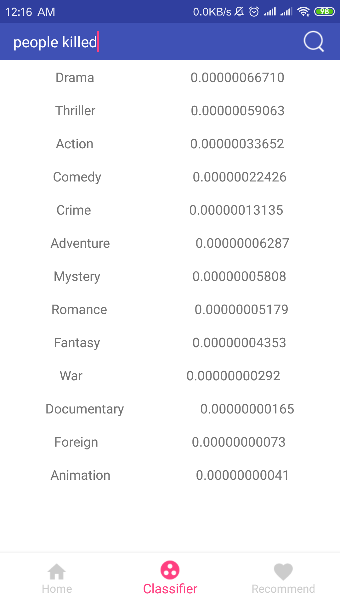

# Movie Project


# Search Features

In this develop phase I, I have implemented the search features for my app. In this search feature, the users can input any numbers of key words knows as terms and then my system of app will sent this key words to my server. When my server receives these key words, it will perform the search function as quick as possible. After the server can find the Top K results of movies, it will send them back to my app and my app will show these movies to users. This process is very efficiency because I have implemented many optimizing algorithms on it. The user’s experience is also very good. The specific implement of algorithm has been showed below.

## Implementation Procedure 

__Deployment Instruction__
* Download the Java Server and Android App Client
* Open the Apache web server with port 8080, and run the java server on Intellij
* Open the Android App on Android Studio
* Connect your computer with an Android Simulator
* Click the Run button to compile the project and run it on the Android Simulator

__Implementation Instruction__
* Build Java Server with SSM framework and read the movies data from CSV files to Mysql Database.
* Tokenize the content of each movie.
* Tokenize the content of each movie.
* Perform stopword removal on the obtained tokens.
* Perform stemming on the obtained tokens.  
* Using the tokens, compute the TF-IDF vector for each movie. Use the following equation that we learned in the lectures to calculate the  term weights, in which t is a token and d is a movie, and TF-IDF vectors have been normalized. 
```
W(t,d)=(1+logTF(t,d))*(log(N/DF(t)))
```
* Given a query string, calculate the query vector and convert it to lower case. In calculating the query vector, don't consider IDF., use the following equation to calculate the term weights in the query vector, in which t is a token and q is the query, and the vector will also be normalized. 
```
W(t,q)=(1+logTF(t,q))
```
* Compute the cosine similarity between query and all of movies to find the movies that attains the highest Top-K cosine similarity score and send back to Android Client.

## Android App Client


## Contributions

I have improved the efficiency of search features.

* For each token that exists in the corpus, construct its postings list. The elements in the list are sorted by weights in descending order.
* For each token in the query, return the top-10 elements in its corresponding postings list. If the token doesn't exist in the corpus, ignore it.
* If a document appears in the top-10 elements of every query token, calculate its cosine similarity score.
* If a document doesn't appear in the top-10 elements of some query token, use the weight in the 10th element as the upper-bound on its weight in the vector.
* If there isn't such a document, it will go deeper than 10 elements into the postings list of each query token.

## Challenge

Because, in the bag of word model, the matrix between word and documents are very sparse, the computing time on TF-IDF and consine similarity is very long. This is the most challenging problem on search features.

For my search system, I rank the TF-IDF scores first and just keep the top K number and its documents for every terms. So when the system do the cosine similarity job, it will just calculate the top K score and return the results. It has saved a great number of computing time. Even its computing time is only O(1).

# Classification Features

I have implemented the classifier to classify the genre features of movie and improved its performence. 

## Implementation Procedure 
__Naive Bayes__
* Calculate the number of documents in the specific class and then compute its posibility P(class) and P(not the class).
* Calculate the number of terms from the query in the specific class as T, the number of all terms in the specific class as B and the number of unique terms in all of documents as ALL. Then, I split the auery to different terms. Because I use the smooth version of NBC, so the function is below.
```
P(class|query) = P(class) * P(term1|class) * P(term2|class) * P(term3|class)......

P(term1|class)  = (T + 1) / (ALL + B)
```
* Then rank the result of P(class|query) as descending order.

__SVM__

* Use the SVM functions as the loss function to calculate its value of W and update its W by Gradient Decent method. The kernel of SVM is Guassin Kernel as cost function and the right part of function, 0.5 * the sum of W*W, is regularization method for ML problem. Then, use one vs all method to solve the mutilclass solutions.

## Android App Client



## Contributions

* Because the matrix between words and documents are very sparse and the number of words as features in machine learning problem is bigger than the number of documents, it will lead to overfitting problem.
* In order to solve this overfitting problem, I have improve the performance by using dimensionality reduction named as SVD. K is a number which can be choosed by validation testing. And the query also used the same U matrix.
```
[U, S, V] = svd ( matrix )

Ureduce = U(1:end, 1:k)

Result = Ureduce * matrix
```
* After using SVD, the number of words as features in machine learning problem is smaller than the number of documents. It means the number of examples are bigger. So the overfitting problem can be solved.

## Challenge

* The most challeng part is to improve the performance of classifier like SVM. In order to solve the overfitting problem to improve its performance, I need to solve the underfitting problem first. Using the kernel to train the model and turing parameters to get the best classification scores for training data. Then using method of Regularization and SVD to reduce the accuracy score of training data and improve the accuracy score of testing data. Finally, the performance of classifier has been improved.

# References
* [IR-book](https://nlp.stanford.edu/IR-book)
* [wiki](https://en.wikipedia.org/wiki/Tf%E2%80%93idf)
* [picasso](https://github.com/square/picasso)
* [java server](https://github.com/crossoverJie/SSM)
* [okhttp](https://github.com/square/okhttp)
* [retrofit](https://github.com/square/retrofit)
* [apache](https://opennlp.apache.org/)
* [machine learning](https://medium.com/machine-learning-101/chapter-2-svm-support-vector-machine-theory-f0812effc72)
